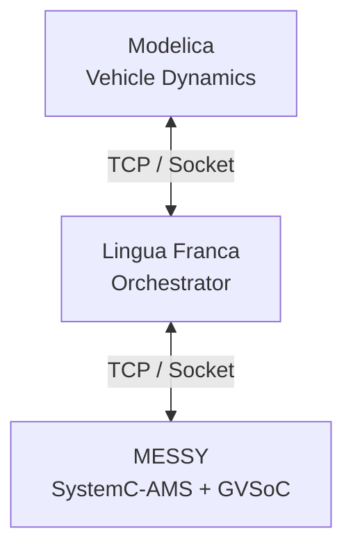

# Black Mesa System


## Overview

**Black Mesa System** is a heterogeneous co-simulation framework designed for cyber-physical systems, enabling deterministic orchestration across multiple simulation domains.

It integrates:

- **Modelica** → physical system dynamics (vehicle suspension)
- **Lingua Franca (LF)** → deterministic orchestration layer
- **SystemC-AMS + GVSoC (MESSY)** → hardware and embedded execution

---

## Key Contribution

This project does **not replace** the original MESSY framework.

Instead, it provides:

> **A structured and reproducible extension layer that enables cross-domain co-simulation orchestration.**

Key contributions include:

- Deterministic orchestration using **Lingua Franca**
- Cross-domain data synchronization via **TCP-based interfaces**
- Integration of physical models, control logic, and embedded execution
- Extension of MESSY into a multi-layer cyber-physical simulation platform

---

## Current Research Focus

This project has been applied to the study of **regenerative suspension systems**, where control strategies, energy recovery mechanisms, and physical dynamics are jointly simulated.

---

## General Capability

Beyond regenerative suspension, the framework is designed as a **general-purpose co-simulation platform**, capable of supporting:

- advanced vehicle control systems (active suspension, ADAS)
- sensor fusion and perception-driven control
- hardware-in-the-loop (HIL) experiments
- cyber-physical system validation
- cross-layer simulation from physics to embedded software

The architecture allows flexible extension to other domains where tight coupling between physical models, control logic, and embedded execution is required.

# System Architecture

The Black Mesa System is composed of multiple layers that interact through a co-simulation pipeline.

The execution flow of the system is:

Lingua Franca orchestration          
↓  
MESSY SystemC-AMS + GVSoC simulation       
↓  
Modelica physical vehicle model   

Lingua Franca acts as the coordination layer that manages communication between the different simulation environments.

---
## Repository Structure

```text
BlackMesaSystem/
├── .git/
├── docker/
│   ├── MESSY/
│   │   ├── example/
│   │   ├── src/
│   │   ├── include/
│   │   └── readme.txt
│   └── README.md
│
├── lf/
│   ├── include/
│   ├── lib/
│   ├── share/
│   ├── src/
│   └── README.md
│
├── modelica/
│   ├── Mclient/
│   └── README.md
│
├── .gitignore
├── LICENSE
└── README.md
```
---

# Components

## Modelica

The **Modelica** subsystem implements the physical dynamic model of the vehicle suspension system.

Main components include:

- full car suspension dynamics
- road disturbance generator
- passive suspension baseline
- TCP communication interface for LF coupling

See:

modelica/README.md

---

## Lingua Franca

The **Lingua Franca (LF)** subsystem provides the orchestration layer of the co-simulation framework.

It is responsible for:

- scheduling simulation execution
- coordinating data exchange
- managing communication between subsystems

See:

lf/README.md

---

## MESSY / SystemC-AMS Environment

The **docker** directory contains the simulation environment based on the **MESSY framework**.

This environment includes:

- SystemC-AMS simulation modules
- GVSoC embedded system simulation
- sensor and power system models
- communication interfaces for co-simulation

The environment is distributed as a Docker image to ensure reproducibility.

See:

docker/README.md

---

# Running the Simulation

The simulation requires three components to be started in the correct order.

Execution order:

1. Lingua Franca server  
2. MESSY SystemC-AMS simulation  
3. Modelica physical simulation  

---

# Step 1 — Start Lingua Franca Server


## Run Lingua Franca Server

Navigate to the `lf/src` directory and compile the LF program:

```bash
cd lf/src
lfc mesa2.lf
cd ../bin  //The compiled executable will be generated in the lf/bin directory.
mesa2.exe
```
Alternatively, the program can also be built and executed within an IDE environment (e.g., VSCode with Lingua Franca extension).
The LF server must remain running during the entire simulation.

---

# Step 2 — Start the MESSY Simulation

## Run MESSY Simulation

Before running the MESSY simulation, the source code in the Docker environment must be aligned with this repository.

### Prepare MESSY Source Code
First, run the read_write_sensor example of origin MESSY system: like shown in: https://eml-eda.github.io/messy/examples/read-write-sensor/
See detail in: docker/README.md

Replace the corresponding files in the MESSY framework:

```text
Copy from (this repository):
docker/MESSY/src/

→ To (inside Docker container):
/messy/messy/src/
```
```text
```text
Copy from (this repository):
docker/MESSY/src/converter/

→ To (inside Docker container):
/messy/messy/src/converter/
```
```text
Copy from (this repository):
docker/MESSY/include/

→ To (inside Docker container):
/messy/messy/include/
```
```text
Copy from (this repository):
docker/MESSY/include/converter/

→ To (inside Docker container):
/messy/messy/include/converter/
```
Replace the example application:
```text
Copy from (this repository):
docker/MESSY/example/

→ To (inside Docker container):
/messy/examples/read_write_sensor/
```
Build Application

Compile the MESSY application (this step builds the example program and links it with the MESSY framework):
```text
make application app=/messy/examples/read_write_sensor
make run
```

---

# Step 3 — Start the Modelica Simulation


Navigate to the `modelica/Mclient` directory and open the Modelica project using a Modelica-compatible environment (e.g., OpenModelica: https://openmodelica.org/download/download-windows/).

Run the auto load script:

- `package.mo`
  
Run the desired top-level model:

- `TestFullCarRoad_ActiveVsPassive.mo`

The Modelica model communicates with the Lingua Franca server via a TCP-based interface.

---

# Execution Summary

The complete workflow is:

Start Lingua Franca server  
↓  
Start MESSY simulation  
↓  
Start Modelica simulation  

The system components will then exchange data during the co-simulation process.

---

# Requirements


This project has been developed and tested primarily in the following environment:

- Windows 10 / 11
- Docker Desktop for the MESSY simulation environment
- Lingua Franca compiler
- OpenModelica
- C++ compiler (e.g., MSVC)

> The overall workflow is executed on Windows, while the MESSY framework runs inside a Docker container.
---

# Research Purpose

The Black Mesa System was developed to support research on:

- vehicle suspension dynamics
- cyber-physical systems
- co-simulation frameworks
- embedded control system integration

The framework enables coordinated experimentation across physical models and embedded system simulations.

---

# Notes

This repository provides the integration framework and modified components required to reproduce the suspension co-simulation environment.

Some components are derived from external open-source projects.  
Please refer to the original upstream repositories for their complete source code and licensing terms.

---

# Contact

For questions regarding the Black Mesa System or reproduction instructions, please contact the repository authors.

This repository is released under the MIT License.
See the LICENSE file for details.
